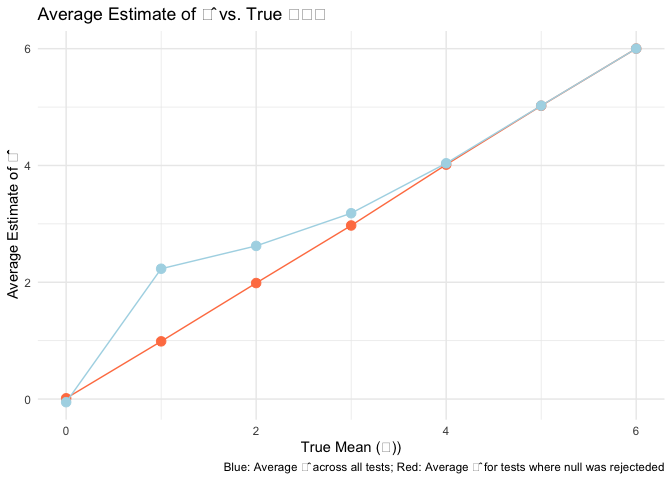

p8105_hw5_iah2124
================
Iris Hart
2024-11-13

## Problem 1 Birthday problem!!!

Let’s put people in a room.

``` r
bday_sim = function(n) {
  bdays = sample(1:365, size = n, replace = TRUE)
  
  duplicate = length(unique(bdays)) < n
  return(duplicate)
  
}
bday_sim(10)
```

    ## [1] FALSE

run this a lot

``` r
sim_res = 
  expand_grid(
    n = 2:50,
    iter = 1:10000
  ) |> 
  mutate(res = map_lgl(n, bday_sim)) |> 
  group_by(n) |> 
  summarize(prob = mean(res))
sim_res |> 
  ggplot(aes(x = n, y = prob )) + 
  geom_line() + 
  labs(
    title = "Probability of Shared Birthday vs. Group Size",
    x = "Group Size (n)",
    y = "Probability of Shared Birthday"
  ) +
  theme_minimal()
```

<!-- -->
With increases group size, the likelihood that at least two people in a
group share the same birthday increases. By the time the group size
reaches n = 50, there is almost a 100% chance that at least two people
have the same birthday.

Turn this into a function (extra)

``` r
sim_regression = function(n) {
  
  sim_data = 
    tibble(
      x = rnorm(n, mean = 1, sd = 1),
      y = 2 + 3 * x + rnorm(n, 0, 1)
    )
  lm_fit = lm(y ~ x, data = sim_data)
  out_df = 
    tibble(
      beta0_hat = coef(lm_fit)[1],
      beta1_hat = coef(lm_fit)[2]
    )
  
  return(out_df)
}
sim_res = 
  expand_grid(
    sample_size = c(30, 60), 
    iter = 1:1000
  ) |> 
  mutate(lm_res = map(sample_size, sim_regression)) |> 
  unnest(lm_res)
sim_res |> 
  mutate(sample_size = str_c("n = ", sample_size)) |> 
  ggplot(aes(x = sample_size, y = beta1_hat)) + 
  geom_boxplot() +
    labs(
    title = "Distribution of Beta1 Estimates for Different Sample Sizes",
    x = "Sample Size",
    y = "Beta1 Estimate"
  ) +
  theme_minimal()
```

<!-- -->

``` r
sim_res |> 
  filter(sample_size == 30) |> 
  ggplot(aes(x = beta0_hat, y = beta1_hat)) +
  geom_point() + 
  labs(
    title = "Scatter Plot of Beta0 vs Beta1 Estimates for n = 30",
    x = "Beta0 Estimate",
    y = "Beta1 Estimate"
  ) +
  theme_minimal()
```

<!-- -->

## Problem 2

Make a plot showing the proportion of times the null was rejected (the
power of the test) on the y axis and the true value of 𝜇 on the x axis.

``` r
n <- 30    
sigma <- 5 
alpha <- 0.05  
n_sim <- 5000


simulate_power <- function(mu) {
  p_values <- replicate(n_sim, {
    data <- rnorm(n, mean = mu, sd = sigma)
    t_test <- t.test(data, mu = 0)
    t_test$p.value
  })
  mean(p_values < alpha)
}

mu_values <- 0:6

power_values <- sapply(mu_values, simulate_power)

power_df <- tibble(mu = mu_values, power = power_values)

ggplot(power_df, aes(x = mu, y = power)) +
  geom_point() +
  geom_line() +
  labs(
    title = "Power of One-Sample t-Test as a Function of True Mean (Effect Size)",
    x = "True Mean (μ)",
    y = "Power (Proportion of Null Rejections)"
  ) +
  theme_minimal()
```

<!-- -->
Describe the association between effect size and power. As the true mean
value increases, the power begisn to increase drastically. By the time
the true mean reaches 4, the power levels out to be 1.00, flattening the
steep curve upwards.

Make a plot showing the average estimate of 𝜇̂ on the y axis and the true
value of 𝜇 on the x axis. Make a second plot (or overlay on the first)
the average estimate of 𝜇̂ only in samples for which the null was
rejected on the y axis and the true value of 𝜇 on the x axis.

``` r
simulate_estimates <- function(mu) {
  results <- replicate(n_sim, {
    data <- rnorm(n, mean = mu, sd = sigma)
    t_test <- t.test(data, mu = 0)
    c(sample_mean = mean(data), p_value = t_test$p.value)
  })
 sample_means <- results[1, ]
  p_values <- results[2, ]
  
  avg_sample_mean <- mean(sample_means)

  avg_sample_mean_rejected <- mean(sample_means[p_values < alpha])
  
  c(avg_sample_mean = avg_sample_mean, avg_sample_mean_rejected = avg_sample_mean_rejected)
}

estimates <- sapply(mu_values, simulate_estimates)

estimates_df <- tibble(
  mu = mu_values,
  avg_sample_mean = estimates[1, ],
  avg_sample_mean_rejected = estimates[2, ]
)

ggplot(estimates_df, aes(x = mu)) +
  geom_point(aes(y = avg_sample_mean), color = "coral", size = 3) +
  geom_line(aes(y = avg_sample_mean), color = "coral") +
  geom_point(aes(y = avg_sample_mean_rejected), color = "lightblue", size = 3) +
  geom_line(aes(y = avg_sample_mean_rejected), color = "lightblue") +
  labs(
    title = "Average Estimate of 𝜇̂ vs. True 𝜇",
    x = "True Mean (𝜇)",
    y = "Average Estimate of 𝜇̂",
    caption = "Blue: Average 𝜇̂ across all tests; Red: Average 𝜇̂ for tests where null was rejected"
  ) +
  theme_minimal()
```

<!-- --> Is
the sample average of 𝜇̂ across tests for which the null is rejected
approximately equal to the true value of 𝜇? Why or why not?

The average estimated mean for tests where the null hypothesis was
rejected deviates from the true value between effect sizes of 0 and 4,
with the estimated values being higher than the true value. This occurs
because the power to detect a significant difference is lower at smaller
effect sizes, meaning a larger difference between the estimated and true
values is needed to reject the null hypothesis when the effect size is
smaller.

## Problem 3

Loading and viewing homicide data

``` r
homicide_df <- read_csv("homicide-data.csv") 
```

    ## Rows: 52179 Columns: 12
    ## ── Column specification ────────────────────────────────────────────────────────
    ## Delimiter: ","
    ## chr (9): uid, victim_last, victim_first, victim_race, victim_age, victim_sex...
    ## dbl (3): reported_date, lat, lon
    ## 
    ## ℹ Use `spec()` to retrieve the full column specification for this data.
    ## ℹ Specify the column types or set `show_col_types = FALSE` to quiet this message.

``` r
summary(homicide_df)
```

    ##      uid            reported_date       victim_last        victim_first      
    ##  Length:52179       Min.   : 20070101   Length:52179       Length:52179      
    ##  Class :character   1st Qu.: 20100318   Class :character   Class :character  
    ##  Mode  :character   Median : 20121216   Mode  :character   Mode  :character  
    ##                     Mean   : 20130899                                        
    ##                     3rd Qu.: 20150911                                        
    ##                     Max.   :201511105                                        
    ##                                                                              
    ##  victim_race         victim_age         victim_sex            city          
    ##  Length:52179       Length:52179       Length:52179       Length:52179      
    ##  Class :character   Class :character   Class :character   Class :character  
    ##  Mode  :character   Mode  :character   Mode  :character   Mode  :character  
    ##                                                                             
    ##                                                                             
    ##                                                                             
    ##                                                                             
    ##     state                lat             lon          disposition       
    ##  Length:52179       Min.   :25.73   Min.   :-122.51   Length:52179      
    ##  Class :character   1st Qu.:33.77   1st Qu.: -96.00   Class :character  
    ##  Mode  :character   Median :38.52   Median : -87.71   Mode  :character  
    ##                     Mean   :37.03   Mean   : -91.47                     
    ##                     3rd Qu.:40.03   3rd Qu.: -81.76                     
    ##                     Max.   :45.05   Max.   : -71.01                     
    ##                     NA's   :60      NA's   :60

This homicide dataset contains 52179 observations with 12 variables
including city id, reported date, victim first name and last name, race,
age, sex, city, state, latitude, longitude, and disposition.

Creating city state variable and summary

``` r
homicide_summary = 
  homicide_df |> 
  mutate(city_state = str_c(city, state, sep = ", ")) |> 
  group_by(city_state) |> 
  summarize(
    total_homicides = n(),
    unsolved_homicides = sum(disposition %in% c("Closed without arrest", "Open/No arrest"))
  ) |> 
  ungroup()
```

Baltimore - unsolved homicide proportion

``` r
baltimore_df =
  homicide_summary |> 
  filter(city_state == "Baltimore, MD") |> 
  summarize(
    test = list(prop.test(unsolved_homicides, total_homicides) |> 
                  tidy())
  ) |> 
  unnest(test) |> 
  select(estimate,conf.low, conf.high)
baltimore_df
```

    ## # A tibble: 1 × 3
    ##   estimate conf.low conf.high
    ##      <dbl>    <dbl>     <dbl>
    ## 1    0.646    0.628     0.663

Proportion of unsolved homicides in all cities

``` r
all_cities_df =
  homicide_summary |> 
  group_by(city_state) |> 
  summarize(
    total_homicides = sum(total_homicides),
    unsolved_homicides = sum(unsolved_homicides),
    .groups = "drop"
  ) |> 
  mutate(
    test_results = map2(unsolved_homicides, total_homicides, ~ tidy(prop.test(.x, .y)))
  ) |> 
  unnest(test_results) |> 
  select(city_state, estimate, conf.low, conf.high)
```

    ## Warning: There was 1 warning in `mutate()`.
    ## ℹ In argument: `test_results = map2(...)`.
    ## Caused by warning in `prop.test()`:
    ## ! Chi-squared approximation may be incorrect

``` r
all_cities_df
```

    ## # A tibble: 51 × 4
    ##    city_state      estimate conf.low conf.high
    ##    <chr>              <dbl>    <dbl>     <dbl>
    ##  1 Albuquerque, NM    0.386    0.337     0.438
    ##  2 Atlanta, GA        0.383    0.353     0.415
    ##  3 Baltimore, MD      0.646    0.628     0.663
    ##  4 Baton Rouge, LA    0.462    0.414     0.511
    ##  5 Birmingham, AL     0.434    0.399     0.469
    ##  6 Boston, MA         0.505    0.465     0.545
    ##  7 Buffalo, NY        0.612    0.569     0.654
    ##  8 Charlotte, NC      0.300    0.266     0.336
    ##  9 Chicago, IL        0.736    0.724     0.747
    ## 10 Cincinnati, OH     0.445    0.408     0.483
    ## # ℹ 41 more rows

Creating estimate plot with each city

``` r
all_cities_df |> 
  mutate(city_state = fct_reorder(city_state, estimate)) |> 
  ggplot(aes(x = city_state, y = estimate, color = city_state)) +
  geom_point(size = 2) +
  geom_errorbar(aes(ymin = conf.low, ymax = conf.high), width = 0.25, color = "royalblue") +
  coord_flip() +
  labs(
    title = "Proportion of Unsolved Homicides by City",
    x = "City",
    y = "Estimated Proportion of Unsolved Homicides"
  ) +
  theme_minimal() +
  theme(legend.position = "none")
```

<!-- -->
