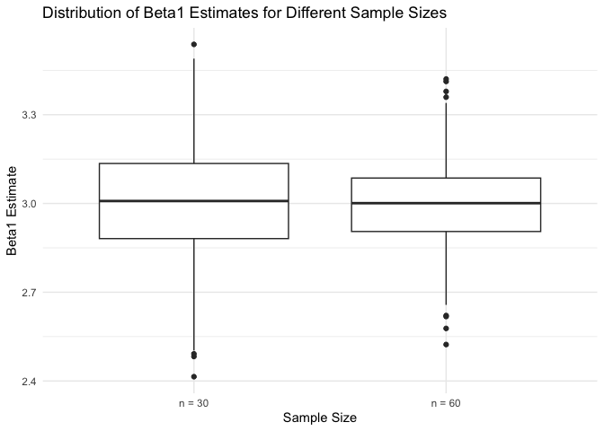

p8105_hw5_iah2124
================
Iris Hart
2024-11-13

## Problem 1 Birthday problem!!!

Let’s put people in a room.

``` r
bday_sim = function(n) {
  bdays = sample(1:365, size = n, replace = TRUE)
  
  duplicate = length(unique(bdays)) < n
  return(duplicate)
  
}
bday_sim(10)
```

    ## [1] FALSE

run this a lot

``` r
sim_res = 
  expand_grid(
    n = 2:50,
    iter = 1:10000
  ) |> 
  mutate(res = map_lgl(n, bday_sim)) |> 
  group_by(n) |> 
  summarize(prob = mean(res))
sim_res |> 
  ggplot(aes(x = n, y = prob )) + 
  geom_line() + 
  labs(
    title = "Probability of Shared Birthday vs. Group Size",
    x = "Group Size (n)",
    y = "Probability of Shared Birthday"
  ) +
  theme_minimal()
```

<!-- -->
Turn this into a function

``` r
sim_regression = function(n) {
  
  sim_data = 
    tibble(
      x = rnorm(n, mean = 1, sd = 1),
      y = 2 + 3 * x + rnorm(n, 0, 1)
    )
  lm_fit = lm(y ~ x, data = sim_data)
  out_df = 
    tibble(
      beta0_hat = coef(lm_fit)[1],
      beta1_hat = coef(lm_fit)[2]
    )
  
  return(out_df)
}
sim_res = 
  expand_grid(
    sample_size = c(30, 60), 
    iter = 1:1000
  ) |> 
  mutate(lm_res = map(sample_size, sim_regression)) |> 
  unnest(lm_res)
sim_res |> 
  mutate(sample_size = str_c("n = ", sample_size)) |> 
  ggplot(aes(x = sample_size, y = beta1_hat)) + 
  geom_boxplot() +
    labs(
    title = "Distribution of Beta1 Estimates for Different Sample Sizes",
    x = "Sample Size",
    y = "Beta1 Estimate"
  ) +
  theme_minimal()
```

<!-- -->

``` r
sim_res |> 
  filter(sample_size == 30) |> 
  ggplot(aes(x = beta0_hat, y = beta1_hat)) +
  geom_point() + 
  labs(
    title = "Scatter Plot of Beta0 vs Beta1 Estimates for n = 30",
    x = "Beta0 Estimate",
    y = "Beta1 Estimate"
  ) +
  theme_minimal()
```

<!-- -->

## Problem 2

Make a plot showing the proportion of times the null was rejected (the
power of the test) on the y axis and the true value of 𝜇 on the x axis.

``` r
n <- 30    
sigma <- 5 
alpha <- 0.05  
n_sim <- 5000


simulate_power <- function(mu) {
  p_values <- replicate(n_sim, {
    data <- rnorm(n, mean = mu, sd = sigma)
    t_test <- t.test(data, mu = 0)
    t_test$p.value
  })
  mean(p_values < alpha)
}

mu_values <- 0:6

power_values <- sapply(mu_values, simulate_power)

power_df <- tibble(mu = mu_values, power = power_values)

ggplot(power_df, aes(x = mu, y = power)) +
  geom_point() +
  geom_line() +
  labs(
    title = "Power of One-Sample t-Test as a Function of True Mean (Effect Size)",
    x = "True Mean (μ)",
    y = "Power (Proportion of Null Rejections)"
  ) +
  theme_minimal()
```

<!-- -->
Describe the association between effect size and power.

Make a plot showing the average estimate of 𝜇̂ on the y axis and the true
value of 𝜇 on the x axis. Make a second plot (or overlay on the first)
the average estimate of 𝜇̂ only in samples for which the null was
rejected on the y axis and the true value of 𝜇 on the x axis.

``` r
simulate_estimates <- function(mu) {
  results <- replicate(n_sim, {
    data <- rnorm(n, mean = mu, sd = sigma)
    t_test <- t.test(data, mu = 0)
    c(sample_mean = mean(data), p_value = t_test$p.value)
  })
 sample_means <- results[1, ]
  p_values <- results[2, ]
  
  avg_sample_mean <- mean(sample_means)

  avg_sample_mean_rejected <- mean(sample_means[p_values < alpha])
  
  c(avg_sample_mean = avg_sample_mean, avg_sample_mean_rejected = avg_sample_mean_rejected)
}

estimates <- sapply(mu_values, simulate_estimates)

estimates_df <- tibble(
  mu = mu_values,
  avg_sample_mean = estimates[1, ],
  avg_sample_mean_rejected = estimates[2, ]
)

ggplot(estimates_df, aes(x = mu)) +
  geom_point(aes(y = avg_sample_mean), color = "coral", size = 3) +
  geom_line(aes(y = avg_sample_mean), color = "coral") +
  geom_point(aes(y = avg_sample_mean_rejected), color = "lightblue", size = 3) +
  geom_line(aes(y = avg_sample_mean_rejected), color = "lightblue") +
  labs(
    title = "Average Estimate of 𝜇̂ vs. True 𝜇",
    x = "True Mean (𝜇)",
    y = "Average Estimate of 𝜇̂",
    caption = "Blue: Average 𝜇̂ across all tests; Red: Average 𝜇̂ for tests where null was rejected"
  ) +
  theme_minimal()
```

<!-- --> Is
the sample average of 𝜇̂ across tests for which the null is rejected
approximately equal to the true value of 𝜇? Why or why not?

## Problem 3

``` r
homicide_df <- read_csv("homicide-data.csv") |>
    mutate(city_state = map2(city, state, ~ paste(.x, .y, sep = ","))) 
```

    ## Rows: 52179 Columns: 12
    ## ── Column specification ────────────────────────────────────────────────────────
    ## Delimiter: ","
    ## chr (9): uid, victim_last, victim_first, victim_race, victim_age, victim_sex...
    ## dbl (3): reported_date, lat, lon
    ## 
    ## ℹ Use `spec()` to retrieve the full column specification for this data.
    ## ℹ Specify the column types or set `show_col_types = FALSE` to quiet this message.
