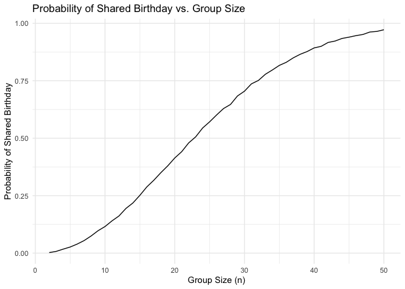

p8105_hw5_iah2124
================
Iris Hart
2024-11-13

## Problem 1 Birthday problem!!!

Let’s put people in a room.

``` r
bday_sim = function(n) {
  bdays = sample(1:365, size = n, replace = TRUE)
  
  duplicate = length(unique(bdays)) < n
  return(duplicate)
  
}
bday_sim(10)
```

    ## [1] FALSE

run this a lot

``` r
sim_res = 
  expand_grid(
    n = 2:50,
    iter = 1:10000
  ) |> 
  mutate(res = map_lgl(n, bday_sim)) |> 
  group_by(n) |> 
  summarize(prob = mean(res))
sim_res |> 
  ggplot(aes(x = n, y = prob )) + 
  geom_line()
```

<!-- -->
Turn this into a function

``` r
sim_regression = function(n) {
  
  sim_data = 
    tibble(
      x = rnorm(n, mean = 1, sd = 1),
      y = 2 + 3 * x + rnorm(n, 0, 1)
    )
  lm_fit = lm(y ~ x, data = sim_data)
  out_df = 
    tibble(
      beta0_hat = coef(lm_fit)[1],
      beta1_hat = coef(lm_fit)[2]
    )
  
  return(out_df)
}
sim_res = 
  expand_grid(
    sample_size = c(30, 60), 
    iter = 1:1000
  ) |> 
  mutate(lm_res = map(sample_size, sim_regression)) |> 
  unnest(lm_res)
sim_res |> 
  mutate(sample_size = str_c("n = ", sample_size)) |> 
  ggplot(aes(x = sample_size, y = beta1_hat)) + 
  geom_boxplot()
```

<!-- -->

``` r
sim_res |> 
  filter(sample_size == 30) |> 
  ggplot(aes(x = beta0_hat, y = beta1_hat)) +
  geom_point()
```

<!-- -->

## Problem 2

Set parameters

``` r
n <- 30    # Sample size
sigma <- 5 # Standard deviation
alpha <- 0.05  # Significance level
n_sim <- 5000


simulate_power <- function(mu) {
  p_values <- replicate(n_sim, {
    # Generate a dataset from Normal(mu, sigma^2)
    data <- rnorm(n, mean = mu, sd = sigma)
    # Perform a t-test comparing the sample mean to 0
    t_test <- t.test(data, mu = 0)
    t_test$p.value
  })
  mean(p_values < alpha)
}
```

``` r
homicide_df <- read_csv("homicide-data.csv") |>
    mutate(city_state = map2(city, state, ~ paste(.x, .y, sep = ","))) 
```

    ## Rows: 52179 Columns: 12
    ## ── Column specification ────────────────────────────────────────────────────────
    ## Delimiter: ","
    ## chr (9): uid, victim_last, victim_first, victim_race, victim_age, victim_sex...
    ## dbl (3): reported_date, lat, lon
    ## 
    ## ℹ Use `spec()` to retrieve the full column specification for this data.
    ## ℹ Specify the column types or set `show_col_types = FALSE` to quiet this message.
